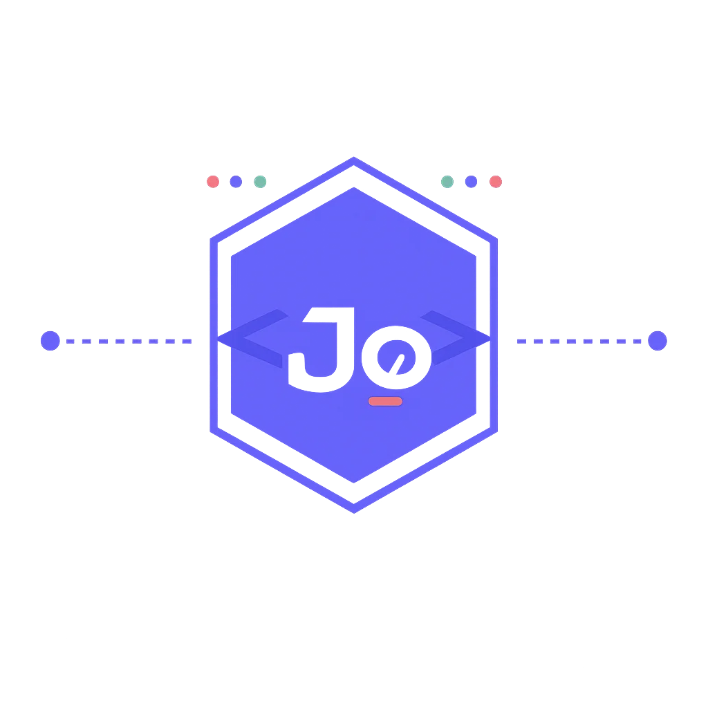

  

  

  # Bonjour, moi c’est Joachim Loick

  

    
Voir mon avatar

     
    
  

  

  

    Je conçois des architectures backend robustes, des APIs performantes et des
    applications fiables, avec une attention particulière portée à la qualité,
    à la sécurité et à la documentation.
  

  
  
  
  

---

## Activité GitHub

  

   

  
  

   

  

   
   

  <picture>
    <source media="(prefers-color-scheme: dark)" srcset="https://raw.githubusercontent.com/jo19lune/jo19lune/output/github-contribution-grid-snake-dark.svg" />
    <source media="(prefers-color-scheme: light)" srcset="https://raw.githubusercontent.com/jo19lune/jo19lune/output/github-contribution-grid-snake.svg" />
    
  </picture>

  

## À propos de moi

-  Développeur orienté backend, APIs et systèmes distribués
-  Expérience avec les architectures MVC, MVVM, microservices et les design patterns
-  Intérêt pour les APIs sécurisées, l’authentification JWT et la documentation Swagger
-  Développement d’applications cross-platform avec Flutter et React Native
-  Collaboration avec Git, GitHub, Trello et la méthode Agile
-  J’enrichis continuellement ma stack avec les outils cloud, DevOps et JavaScript modernes

## Stack principale

<table>
  <tr>
    <td width="33%" valign="top">
      <strong>Backend et APIs</strong>  
      
      
      
      
      
    </td>
    <td width="33%" valign="top">
      <strong>Frontend et mobile</strong>  
      
      
      
      
    </td>
    <td width="33%" valign="top">
      <strong>Temps réel et plateforme</strong>  
      
      
      
      
      
    </td>
  </tr>
</table>

## Détail de la stack technique

### Backend & APIs

### Bases de données & ORM

### Frontend, mobile & desktop

HTML, CSS, JavaScript, Figma, C# WPF/WinForms, PyQt/Tkinter et Java Swing.

### DevOps, cloud & stockage

Git, GitHub, Linux, Bash, Postman et conteneurisation Docker.

### Organisation & méthodes

- Méthode Agile
- Gestion de tâches et planification avec Trello
- Collaboration et versionnement avec Git / GitHub
- Automatisation CI/CD avec GitHub Actions et Jenkins

> Les outils et technologies sont présentés selon mon expérience actuelle et les
> domaines que je continue à approfondir.

## Intégrations & communication temps réel

| Technologie | Utilisation |
| --- | --- |
| **REST API** | Conception et consommation d’APIs HTTP standardisées |
| **WebSocket** | Communication bidirectionnelle en temps réel |
| **WebHooks** | Notifications événementielles entre services |
| **Redis** | Cache, files d’attente et échanges rapides entre services |
| **MinIO / Cloudinary** | Stockage et gestion de fichiers et médias |

## Projets réalisés

<table>
  <tr>
    <td width="50%" valign="top">
      <h3>InterviewPrep</h3>
      
Application de préparation aux entretiens techniques avec génération et accompagnement assistés par l’intelligence artificielle.

      

        
        
        
      

      <ul>
        <li>Interface cross-platform développée avec Flutter.</li>
        <li>API backend performante construite avec FastAPI.</li>
        <li>Intégration OpenAI pour personnaliser les exercices et les réponses.</li>
      </ul>
    </td>
    <td width="50%" valign="top">
      <h3>ImmoSocial</h3>
      
Plateforme immobilière sociale orientée échanges en temps réel, événements métier et expérience web moderne.

      

        
        
        
        
        
      

      <ul>
        <li>Backend Spring Boot pour les services et la logique métier.</li>
        <li>WebSocket pour les interactions et notifications en temps réel.</li>
        <li>Webhooks pour les événements entre services.</li>
        <li>Frontend React et Vite pour une interface rapide et réactive.</li>
      </ul>
    </td>
  </tr>
</table>

### Autres réalisations

- APIs REST sécurisées avec authentification JWT, gestion des rôles et documentation Swagger.
- Systèmes de gestion connectés à des bases relationnelles.
- Services automatisés, tâches planifiées, traitement de données et migrations Alembic.

## Objectifs

- Concevoir des APIs scalables, sécurisées et bien documentées
- Approfondir les architectures microservices et les environnements cloud
- Renforcer mes pratiques CI/CD, DevOps et observabilité
- Développer des applications web modernes avec Next.js et des APIs NestJS
- Contribuer à des projets open source backend

## Me contacter

  
  
  

   
   

  

